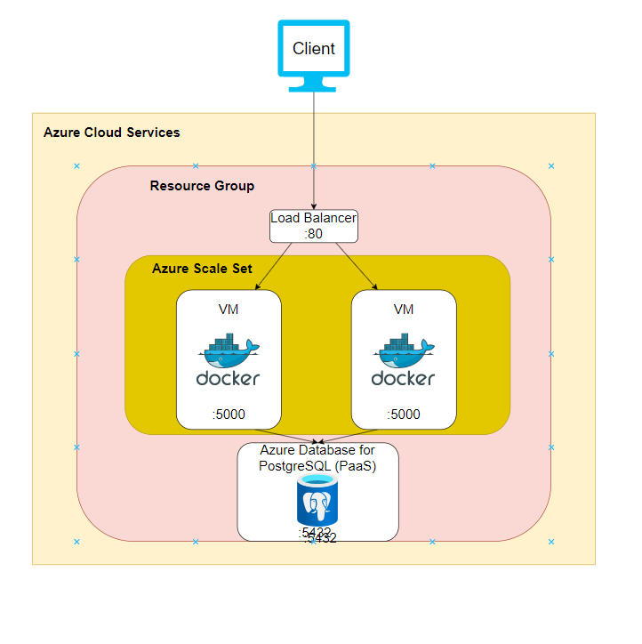
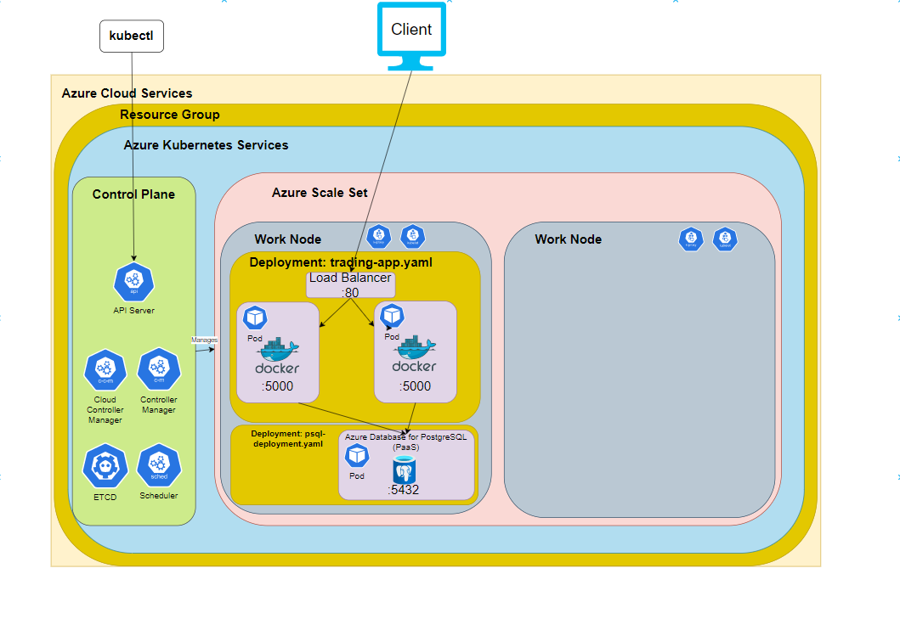
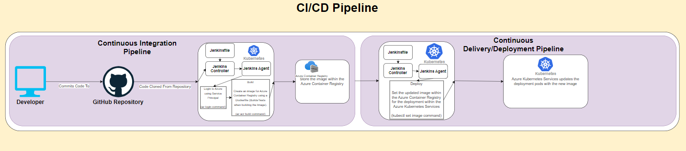

# Introduction
The Cloud, K8S, and DevOps project involves learning about the deployment and operations side in 
software development (DevOps) to deploy the backend RESTful API Spring Boot application from the 
Spring Boot project; To deploy the app, technologies such as the Cloud through Microsoft's Azure 
Cloud Platform, the most popular container orchestration tool Kubernetes and CI/CD pipelines with 
Jenkins were used.

The architecture for deploying the Spring Boot backend REST API to the Azure Cloud Services 
initially involves using a Scale Set with VMs that will scale up or down depending on the usage 
(create duplicate VMs with the same application and settings) and a Load balancer which is exposed 
to the outside world (internet) that diverts traffic to the VMs in the scale set; The VMs in the 
Scale Set accesses an Azure Database for PostgreSQL which is a Platform-as-a-Service that handles 
the updates, backups, etc. while the developer can select which version of PostgreSQL and the data.

Unfortunately, deploying applications using VMs is inefficient as there can be issues when updating 
apps; the developer must access each VM and update it manually or run a script for each instance 
or if a VM. As such, utilizing container orchestrators manages the containers and the updates of 
containers. Container orchestrators allow for high availability since when a container goes down, 
a new container is deployed to a different system/node to take its place. Containers are also more 
lightweight when compared to VMs since they utilize OS-level virtualization and only contain the 
necessary dependencies to run the app.

The final piece for this DevOps project is the CI/CD pipeline. Jenkins is an automation server that 
builds and runs CI/CD pipelines with Jenkinsfiles (configuration/steps the pipeline must perform). 
For this project, the Jenkins CI/CD pipeline builds the application from the Git repository and 
creates an image for the Azure Container Repository; this represents the Continuous Integration 
portion. The pipeline then sets this new image as the updated version, and the container 
orchestrator (K8S) then updates each pod that runs the application.

# Application Architecture
## Application Architecture Diagram


## Kubernetes Deployment Diagram


# Jenkins CI/CD Pipeline

## Diagram


## Description

The Jenkins CI/CD pipeline involves several steps, and the main difference between the 
Jenkinsfile-dev or Jenkinsfile-prod files is which cluster it will be deployed on, and which 
branch the pipeline clones from. 

1. Git clone command
- Clones the git repository since the advanced options involved getting the Jenkinsfile
pipeline from SCM (the git repository).

2. (az login command)
- Login to the Azure CLI so that the Jenkins agent can store the image into the Azure 
Container Registry and update the image within the Azure Kubernetes Service.

3. (az acr build command)
- Creates the image using the Dockerfile from the GitHub repository and store it within 
the Azure Container Registry.
- This Dockerfile takes the src folder, pom.xml, etc. and builds the application within 
the container using Maven, and then sets the entry point to execute the Springboot program

4. (kubectl set image command)
- The command sets the new image for the pods as the one from the Azure Container Registry so that 
the Azure Kubernetes Service can handle updating the deployment pods.


# Improvements
1. Updating the command to create the Azure Service Principal, the new Azure free trial model 
requires a subscription for the service principal to be defined and a role to be specified so 
that the service principal can access resources (container registry, Kubernetes services)
```
az ad sp create-for-rbac -n MyApp --role Contributor 
-- --scopes /subscriptions/00000000-0000-0000-0000-000000000000/resourceGroups/resourceGroup1
```

2. Updating the commands when creating the Kubernetes cluster: within the ticket, a variable called 
K8S_VERSION is created and assigned 'v1.17.11'. However, this version of Kubernetes is no 
longer supported, and the default set by Azure in the web portal is '1.25.6'. So, the 
variable assignment should be:
```
K8S_VERSION='1.25.6'
```

3. Pod experienced an OOMKilled (Out of Memory Killed) error when deploying the Spring boot demo 
onto the Azure Kubernetes Cluster. I assume we must set a different configuration with more memory 
for the Azure Scale Set (Standard_B2ms is the current one and utilizes 8GB of memory).