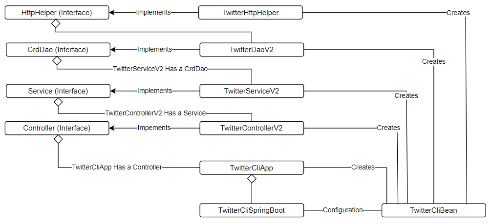

# Introduction
Allows us to perform operations that manage tweets; the Core Java Twitter App lets us post, find, 
and delete tweets all within a command line interface. The program follows the model-view-controller 
architecture design, the controller/service handles inputs and business logic, the model manages 
objects and data retrieved from the Twitter API, and the view is the command line that prints out a 
tweet in a JSON format. To implement these designs, we used technologies such as Twitter RESTful 
API V2 that utilizes HTTP methods to perform the operations on the Twitter servers. Maven is 
another technology that handles the project's dependencies like the Apache HttpClient package that 
allows the app to send HTTP requests, the OAuth signpost package that enables the app to add OAuth 
authentication to the HTTP requests, and the faster XML Jackson Core package that maps JSON 
properties to the tweet data transfer object. Integration and unit testing were utilized with the 
libraries Mockito and JUnit4 to test our applications. Lastly, the Twitter app was deployed within 
a Docker container with Twitter API OAuth keys set as environment variables within the Docker container.

# Quick Start
- How to package your app using Maven?
  - the Maven commands clean, compile and package are used to package the application,
this will clean the target folder, compile the classes, and package it into a JAR file.
```
mvn clean compile package
```
  
- How to run your app with Docker?
  - To run the app with Docker the environment variables with the consumer key, 
consumer secret, access token, and token secret need to be setup. After the environment variables, 
the Docker image must be pulled from Docker Hub and run with the Docker run command.

Setup environment variables (consumerKey, consumerSecret, accessToken, and tokenSecret)
```
export <environmentvariable>=<datahere>
```

Pull image file from Docker Hub
```
docker pull ccalvinnguyen/twitter
```

Run the Docker container using the image (Syntax):
```
docker run --rm -e consumerKey=${consumerKey} -e consumerSecret=${consumerSecret} 
-e accessToken=${accessToken} -e tokenSecret=${tokenSecret} 
ccalvinnguyen/twitter <post/show/tweet> <text/id/id1,id2> <id,text,entities,public_metrics>
```

Example
```
docker run --rm -e consumerKey=${consumerKey} -e consumerSecret=${consumerSecret} 
-e accessToken=${accessToken} -e tokenSecret=${tokenSecret} 
ccalvinnguyen/twitter show 1629865830337990656 id,text
```


# Design
## UML Diagram

## Components
- TwitterHttpHelper
  - The TwitterHttpHelper class is the implementation of the HttpHelper interface, and it is only 
used for taking a URI (and a String JSON), executing HttpUriRequests, and returning a HttpResponse object.
  
- TwitterDaoV2
  - The TwitterDAOV2 class is the implementation of the CrdDao interface. It calls the HttpHelper, 
passes it a URI, and converts the HttpResponse data into a Tweet object.

- TwitterServiceV2
  - The TwitterServiceV2 class is the implementation of the Service interface. It checks if the 
arguments passed by the Controllers are valid and calls the appropriate CrdDao method, retrieves a 
Tweet object, and returns that Tweet object.

- TwitterControllerV2
  - The TwitterControllerV2 class is the implementation of the Controller interface. It passes the 
command arguments to the appropriate Service method and prints the returned Tweet 
object to the command line.

## Models
The Tweet Model is a Data Transfer Object for the DAO and contains basic information about a Tweet. 
The Tweet model's properties are populated with the data from the JSON string body returned in an 
HTTP Response when requesting from the Twitter API V2 endpoints. Examples of the Tweet object 
properties are id, text, public metrics, and entities. The public metrics and entities fields are 
also objects which contain fields like hashtags, mentions, likes, retweets, etc.

## Spring
Spring's dependency injection manages the creation and lifecycles of the components/dependencies/beans 
like the TwitterControllerV2, TwitterServiceV2, TwitterDaoV2, TwitterHttpHelper, and TwitterCliApp. 
The annotation @Component marks these components managed by Spring, and the annotation @Configuration 
marks the TwitterCliBean class that outlines the dependencies relationships. TheTwitterCliBean marks 
each component with the annotation @Bean, and each bean/component will be injected into another 
appropriate component as a dependency only when it is created.

# Test
The application is tested with unit and integration testing using the Junit4 and Mockito libraries. 
These libraries were also setup in the Maven test scope, and when the Maven build command runs, 
it will also run the unit and integration tests to verify if the build is successful.

The Mockito library creates mock objects that are used in place of dependencies, and we can 
control what these mock objects return. Mockito is beneficial for unit testing when the dependencies 
are not implemented, but we know the design of what will be returned, such as, if the Twitter API 
was down, we could still run our tests by passing a dummy Http Response object with a test body.

## Deployment
A Dockerfile is used to Dockerize the app. In this Dockerfile, it sets the base image as an 
openjdk:8-alpine image. The Dockerfile then copies the compiled JAR file into the Docker image 
using the COPY command, and sets the entry point to execute this JAR file with a java -jar command 
using the ENTRYPOINT command.

```Dockerfile
FROM openjdk:8-alpine
COPY target/java_apps-1.0-SNAPSHOT.jar /usr/local/app/twitter/lib/twitter.jar
ENTRYPOINT ["java", "-jar", "/usr/local/app/twitter/lib/twitter.jar"]
```

# Improvements
- Improvement 1
  - Combining the posting and deleting of tweets in the unit and integration tests is crucial as the 
Twitter API does not allow duplicate texts when posting new tweets.
  
- Improvement 2
  - A more in-depth tutorial or an example of testing exceptions within the unit or integration 
tests, for example, (expectation = Exception.class), I learned how to use this by viewing a 
  - tutorial on Baeldung for Junit4.

- Improvement 3
  - A guide or example for working with the Jackson library, JSONs, and object mappers would be an 
improvement. Some fields may not be present in some NoSQL dictionaries as they do not have a 
concrete structure. Unexpected properties may appear; this results in errors because the 
properties are not marked as ignorable. I found how to ignore properties on Baeldung, but this 
way may not include all fields.