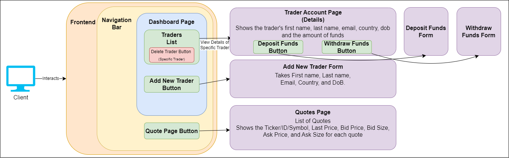

# React Trading Frontend Application

# Introduction
Designed around implementing a Reactjs frontend application that interacts with the backend 
Springboot REST API. The frontend application provides a user interface that lists traders and 
quotes from the backend, allows users to add new traders to the backend database, and deposits or 
withdraws funds from any trader's account. Considering that the frontend application lists all the 
traders and allows one to interact with all of them, the design assumes that the users are the 
administrators.

To implement the frontend application, technologies like Node enables the server environment to run 
JavaScript code. Node Package Manager (npm) is the package manager for Node applications, managing 
the dependencies such as Reactjs and Axios. Reactjs is a library meant for creating user interfaces 
in a single-page manner, rendering them on the server, and serving these HTML elements to the 
client. Axios is a package used in the Reactjs/Node frontend application to send HTTP requests to 
the backend Springboot REST API.

Finally, the frontend application is tested manually and deployed by cloning the GitHub repository, 
installing Node and npm, and running the commands npm install and npm start to start the frontend 
application.

# Quick Start

### If the backend application is not started.
- Pull the docker images for the backend application.
    ```
    docker pull ccalvinnguyen/trading-psql
    docker pull ccalvinnguyen/trading-app
    ```
- Create a docker network so the two backend applications can communicate with one another.
    ```
    docker network create --driver bridge trading-net
    ```
  
- Set the IEX Cloud RESTful API token as an environment variable.
    ```
    export IEX_PUB_TOKEN=<token here>
    ```
  
- Run the two docker containers using the docker images pulled from Docker Hub.
    ```
    docker run --rm --name trading-psql-dev \
    -e POSTGRES_PASSWORD=password \
    -e POSTGRES_DB=jrvstrading \
    -e POSTGRES_USER=postgres \
    --network trading-net -d -p 5432:5432 ccalvinnguyen/trading-psql
    ```
    ```
    docker run -d --rm --name trading-app-dev \
    -e PSQL_HOST=trading-psql-dev \
    -e PSQL_PORT=5432 \
    -e PSQL_USER=postgres \
    -e PSQL_DB=jrvstrading \
    -e PSQL_PASSWORD=password \
    -e IEX_PUB_TOKEN=${IEX_PUB_TOKEN} \
    --network trading-net -p 5000:8080 -t ccalvinnguyen/trading-app
    ```

### Frontend Setup
- Install Node and npm from https://nodejs.org/en.
- Clone the GitHub repository.
    ```
    git clone https://github.com/Jarvis-Consulting-Group/jarvis_data_eng-C-CalvinNguyen.git
    ```
- Within the cloned project directory run the commands npm install and npm start
    ```
    npm install
    npm start
    ```

# Implementation
The frontend application is implemented with Reactjs to build dynamic interactive user interfaces on 
the server and serves the client. Create-React-App initializes the Reactjs application with other 
dependencies such as Babel. Babel takes JSX elements (HTML elements within JavaScript code) and 
compiles/converts them into the Reactjs createElements methods. Other dependencies installed with 
the node package manager (npm) are Axios and ANTD, a library that has preconfigured React 
components. Axios is a library to send HTTP requests to the backend server from the frontend 
application, allowing for dynamic web page content like adding a new user to the trader list.

The frontend application has three specific pages; the dashboard page that includes a list of all 
the traders on the database uses ANTD Reactjs components like a button that opens a modal with a 
form to add new traders and options/buttons to delete or view specific details for a trader. Opening 
the specifics for a trader shows all their information, like current funds, and this page includes 
buttons and modals to either deposit or withdraw funds to that trader's account. The last page is 
a quotes page that lists all the daily quotes within the database.

## Architecture


# Test
Manual testing validates whether the frontend app HTTP requests to the backend application and 
database work. The manual tests also validate each input for the forms in the frontend application 
to ensure no invalid inputs are inserted and sent to the backend.

# Deployment
The frontend application is on the GitHub repository, and deploying the frontend application 
requires installing Node and npm, cloning the GitHub repository, and running commands npm install 
and npm start. The frontend application also requires the backend server to be running, and to start 
the backend server requires pulling the docker images and running the containers.

# Improvements
- Implementing unit tests using JEST.

Much like the backend Springboot application, I believe utilizing the JEST testing library for 
Node and Reactjs applications would benefit the quality of the code and ensure that everything 
functions as expected.

- Issues with setState in the handleOk methods for Modal Forms.

Within the frontend application's states, the form methods specifically handleOk cause issues when 
updating the content with getTraders, etc., and resetting the modal input field states since there 
are two calls to setState. Calling the setState method once is preferred to ensure no bugs during 
the call.

- Implementing Modal Form for adding quotes by Ticker.

Another feature to implement into the frontend application is adding quotes to the database by 
implementing another modal form that sends an HTTP request to the backend and adds this quote from 
the IEX REST API.