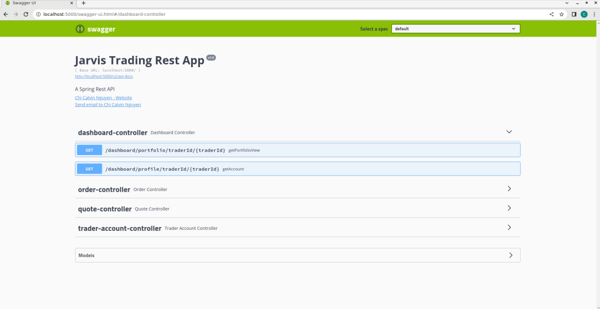
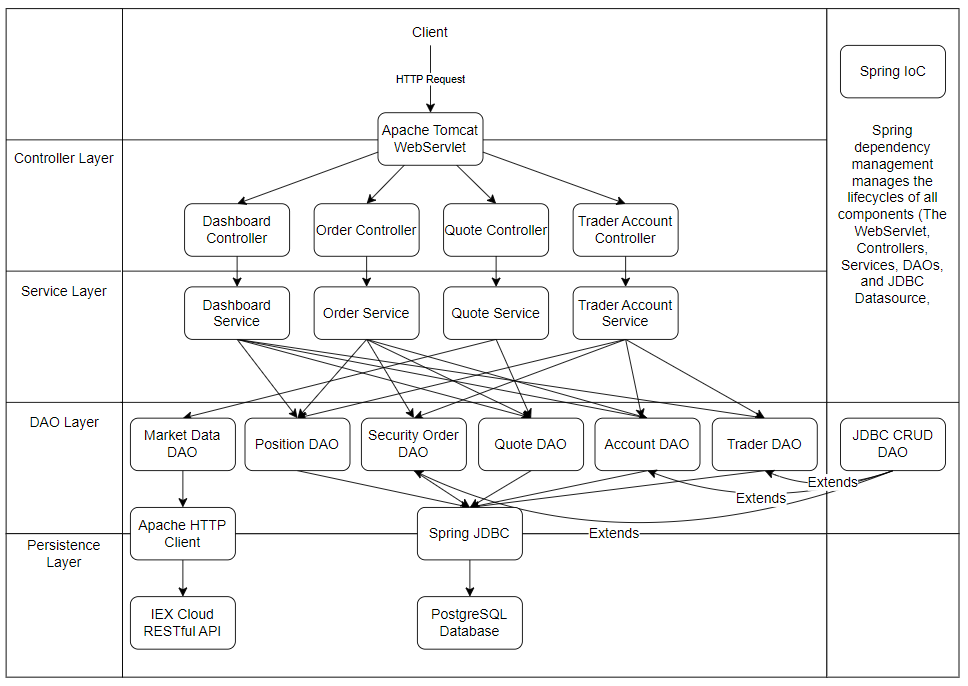
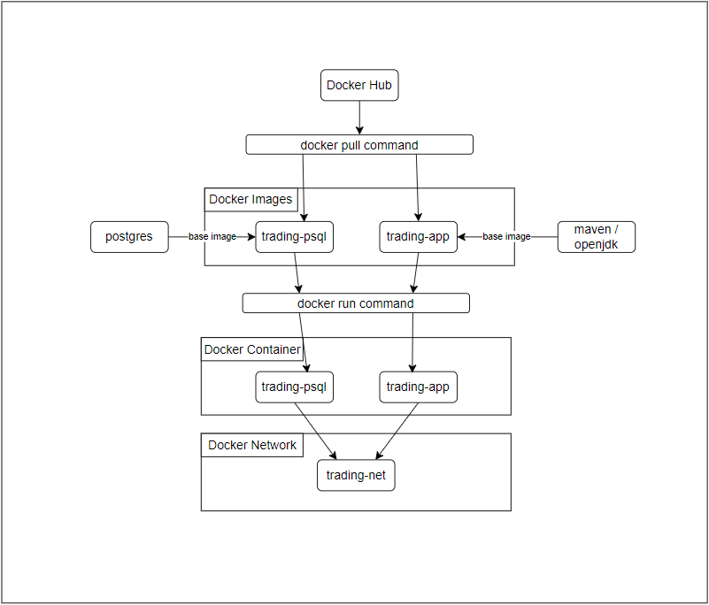

Table of Contents
* [Introduction](#Introduction)
* [Quick Start](#Quick-Start)
* [Implementation](#Implementation)
* [Test](#Test)
* [Deployment](#Deployment)
* [Improvements](#Improvements)

# Introduction

The Spring Boot Trading App project revolves around a hypothetical situation where the Jarvis 
trading team is looking to replace its legacy system due to issues revolving around its monolithic 
nature as it is hard to scale and maintain. As such, this project seeks to build a minimum viable 
product as a proof of concept for the new system and uses the microservice architecture design. The 
microservice architecture design will fix the issues for the legacy system as it is more scalable 
and easily maintainable because each microservice runs independently, meaning scaling it will 
require increasing the number of running services, and due to each service being independent, 
downtime or errors within one should not affect the others.

The trading system is a RESTful API that allows multiple instances to run simultaneously using a 
load balancer for handling large amounts of traffic. The systems operations allow clients to create 
and manage their accounts, manage the funds, and buy or sell stocks within the system as 
market/security orders. All the data for the system persists within a PostgresSQL database. The 
system adds stock quotes that clients can buy or sell through the IEX Cloud RESTful API. The IEX 
Cloud RESTful API provides the latest information about the stock quotes, like the asking price, 
buying price, and last sold price.

This project utilizes technologies and designs such as Docker. Docker provides an isolated 
consistent runtime environment for programs with the necessary dependencies like Alpine Linux. A 
PostgreSQL relational database persists the data like quotes, clients, accounts, and orders. Maven 
manages the dependencies, compiling/building the project, and packaging the project into a JAR file. 
The Apache HttpClient requests the latest stock quote data from the IEX Cloud RESTful API. Swagger 
documents the APIs controllers, models, etc., displays them, and allows for operations on the RESTful 
API. Spring Boot configures Maven with the necessary dependencies and manages the lifecycle of the 
components. These components are classes like controllers, services, and DAOs. Other examples of 
Spring dependencies are the Spring JDBC which abstracts the Java JDBC API and has quality-of-life 
features like managing connections, executing the given statement, and processing exceptions. 
Another of Spring's dependencies is the Spring starter web which includes the Apache Tomcat Web 
Servlet. Web Servlets are implementations of the Java Servlet API and listen to HTTP requests at a 
given port. Using annotations within Spring, the web servlet will choose the appropriate controller 
and method to handle the request at a given path. An optional Spring dependency is the Data JPA 
which stands for Java Persistence API, this Spring dependency further abstracts the Spring JDBC. 
Developers don't need to write SQL code. This API executes SQL code based on the method name, for 
example, getModelById. It requires the DAO to be an interface that extends the JpaRepository 
interface (requires dependencies like an EntityManager and TransactionManager). The model class 
must have the proper annotations so the database table maps to the object.

# Quick Start
- A prerequisite is that Docker must be installed on the system.
- Pull the docker images from Docker Hub
  ```
  docker pull ccalvinnguyen/trading-psql
  docker pull ccalvinnguyen/trading-app
  ```
- Create a docker network so the two applications running on separate containers can communicate.
    ```
    docker network create --driver bridge trading-net
    ```
- Set the IEX Cloud RESTful API Token as an environment variable.
    ```
    export IEX_PUB_TOKEN=<token-here>
    ```
- Run the two docker containers using the docker images pulled from Docker Hub.
    ```
    docker run --rm --name trading-psql-dev \
    -e POSTGRES_PASSWORD=password \
    -e POSTGRES_DB=jrvstrading \
    -e POSTGRES_USER=postgres \
    --network trading-net -d -p 5432:5432 ccalvinnguyen/trading-psql
    ```
    ```
    docker run -d --rm --name trading-app-dev \
    -e PSQL_HOST=trading-psql-dev \
    -e PSQL_PORT=5432 \
    -e PSQL_USER=postgres \
    -e PSQL_DB=jrvstrading \
    -e PSQL_PASSWORD=password \
    -e IEX_PUB_TOKEN=${IEX_PUB_TOKEN} \
    --network trading-net -p 5000:8080 -t ccalvinnguyen/trading-app
    ```
- Test the Trading-App RESTful API using the Swagger UI within a web browser 
(http://localhost:5000/swagger-ui.html). 


# Implementation
## Architecture

- Controller Layer. 

The controller layer consists of various controllers like the quote controller, trader account 
controller, and order controller. Spring annotations like @RequestMapping, @GetMapping, etc., map 
the controllers. So when the Apache Tomcat Web Servlet receives an HTTP request, it will use a 
specific controller and method. These methods will use the associated service to perform an 
operation. The controller returns data within the response body in a JSON format or throws a 
response status exception with an HTTP status code and the exception message.

- Service Layer.

The service layer consists of various service classes like the quote service, trader service, 
account service, and order service. These services perform business logic operations and possess 
one or more DAO classes that retrieve data from the PostgreSQL database or the IEX Cloud RESTful 
API.

- DAO Layer.

The DAO layer consists of several Data Access Objects like the QuoteDAO, TraderDAO, and AccountDAO. 
These DAO classes perform CRUD operations on either the PostgreSQL database or read from the IEX 
Cloud REST API. For the DAO classes to do these operations on the PostgreSQL database, they utilize 
Spring JDBC, and for the DAO classes to read from the IEX Cloud REST API, they use the Apache HTTP 
Client.

- Spring Boot, Apache Tomcat WebServlet, and Spring IoC.

Spring Boot manages the life cycle of components (controllers/services/DAOs) and their dependencies, 
as well as creates the Apache tomcat web servlet. The Apache Tomcat Web Servlet is an implementation 
of the Java Servlet API and receives HTTP requests from clients, maps the URL path to the 
appropriate controllers, and executes the specific method.

- PostgresSQL and IEX Cloud RESTful API.

The PostgreSQL database persists data about the quotes, client trader information, accounts, and 
the account's orders. The IEX Cloud REST API is accessed using the MarketDataDAO with the Apache 
HTTP Client to retrieve the latest information about a quote so that this quote can be added to the 
system's database. Once a quote is added to the database the clients can purchase or sell them.

## REST API Usage
### Swagger
Swagger is a tool that allows a developer to document and display the structure (models) and usage 
(endpoints) of their API. Swagger UI shows the application's model objects and expected 
response/status codes. Swagger UI also allows for the testing of controllers with each endpoint by 
passing data using a request body JSON or path variable.

### Quote Controller
The Quote controller performs operations on the stock quotes within a database using QuoteService, 
QuoteDao, and MarketDataDao objects. These stock quotes are added to the database or updated with 
information from the IEX Cloud RESTful API using the Apache HTTP Client, utilizing the object mapper 
and org.json package to create these quotes and populate the states with data from the response body 
JSON. The Quote object contains the unique symbol/ticker for the stock. 

The Quote object also has other information like the last price for a transaction, 
the highest bid price, bid size, the lowest asking price, asking size, and if the US markets 
are open.

Quote Controller endpoints
- GET /quote/dailyList 

Get the list of all the quotes within the PostgresSQL database in the response body in JSON format.

- GET /quote/iex/ticker/{ticker}

Gets a quote object using the unique ID/symbol/ticker within the path variable {ticker}.

- POST /quote/tickerId/{tickerId}

Creates a quote by getting the information from the IEX Cloud RESTful API and persisting this quote 
object data within the quote table in the PostgresSQL database.

- PUT /quote/

Update a quote record within the PostgresSQL database by passing a quote object within the request 
body in JSON format.

- PUT /quote/iexMarketData

Update every quote within the database with information returned from the IEX Cloud RESTful API.

### Trader Account Controller

The TraderAccountController allows clients to manage a trader profile and its associated account. 
The client can also deposit or withdraw funds from their account to purchase stock quotes.

The Trader object has information like the first name, last name, date of birth, country, and email. 
The account possesses funds and is related to the trader using a foreign key in the database.

Trader Account Controller endpoints.
- POST /trader/firstname/{firstname}/lastname/{lastname}/dob/{dob}/country/{country}/email/{email}
- POST /trader/

Creates a trader with the option of two endpoints. One endpoint uses path variables to pass 
information to the server; the other uses a request body.

- PUT /trader/deposit/traderId/{traderId}/amount/{amount}

Deposit funds into the trader account using the trader ID in the path variables.

- PUT /trader/withdraw/traderId/{traderId}/amount/{amount}

Withdraw funds from the trader account using the trader ID in the path variables.

- DELETE /trader/traderId/{traderId}

Deletes a trader, the associated account, and any related security orders. The trader account must 
have no funds or positions (possesses no stocks).

### Order Controller

The order controller allows clients to create a market order within the request body in a JSON 
format. Using this information, the application either purchases or sells the stocks for the client; 
this order data persists within the PostgresSQL database as a security order and returns this 
security order.

Order Controller endpoints.
- POST /order/marketOrder

Create a market order within the request body in JSON format. This market order can either purchase 
or sell the stock specified and is returned as a security order once it has been processed/saved 
into the database.

### Dashboard Controller

The dashboard controller returns information about the trader by traderId. It can be about the 
trader and the associated account within a TraderAccountView object or the portfolio containing 
the user's current positions.

Dashboard Controller endpoint.
- GET /dashboard/portfolio/traderId/{traderId}

Show the portfolio for the trader by trader ID. It will display all positions with the user's 
current stock within a portfolio view object.

- GET /dashboard/profile/traderId/{traderId}

Show the trader account view for the trader by trader ID, it will show the information for the 
trader, and their associated account with funds.


# Test

The application's DAO and service classes testing uses JUnit4 for integration testing that utilizes 
dependencies like the PostgreSQL database and IEX Cloud RESTful API and Unit testing with Mockito 
to solely test the methods without the dependencies used by mock objects. The Spring boot test 
dependency allows Spring to manage the creation of bean dependencies like the DataSource objects 
and HTTP Client configurations. The testing also utilized code coverage which measures how much 
code runs during the tests. The minimum required code coverage was 50% for all DAOs and services.

# Deployment


- ccalvinnguyen/trading-psql docker image.

The trading-psql docker image uses the Postgres image running Alpine Linux (postgres:9.6-alpine) as 
a base. To initialize the provided SQL scripts (init_db.sql, and schema.sql), the SQL scripts are 
copied into the /docker-entrypoint-initdb.d/ directory that automatically runs these SQL files 
when the container starts.

- ccalvinnguyen/trading-app docker image.

The trading-app docker image uses the maven:3.6-jdk-8-slim base image to build the project. The 
Dockerfile then copies the src directory and the pom.xml file int othe Docker image. It then runs 
the mvn clean package command (it will also skip the tests).

Once Maven has completed packaging the application, the Docker image uses an openjdk:8-alpine base 
image as the application runtime environment by copying the JAR file. Finally, an entry point 
command calls the JAR file using the java command.

# Improvements
1. Error in the init_db.sql file when packaging into the Dockerfile and running with Docker run.

There is an error when copying the init_db.sql file into the docker image; when one uses the 
"docker run" command with the POSTGRES_DB environment variable, it will automatically create the 
jrvstrading database. Once the initialization script runs, it will cause an error where the database 
(jrvstrading) already exists.

2. Spring Data JPA (AccountDAO with Data JPA implementation), as it causes a data integrity error 
when running the HTTP DELETE trader endpoint.

The AccountDao uses a Spring Data JPA implementation, whereas other DAOs like TraderDao use the 
Spring JDBC implementation. When attempting to delete an account and trader from the database, 
it causes a data integrity error as Traderdao attempts to delete the trader before/at the same time 
as the AccountDao. I ignored this issue and used the default Spring JDBC implementation for the 
AccountDao. Fortunately, the QuoteDao with Spring Data JPA does not have this issue.

3. In the Project Kick-off ticket, the provided demo does not check whether an account possesses 
the stock, as such the account can have a negative position. 

There is an issue within the trading-app-demo provided in the project kick-off ticket. When creating 
a market order, the application does not check whether the account possesses stock (has a position) 
to sell that stock. This issue means the client can have a negative size within the security order. 
This issue is rectified in my implementation as it checks whether the client has a position with 
that stock that is above 0 in size.